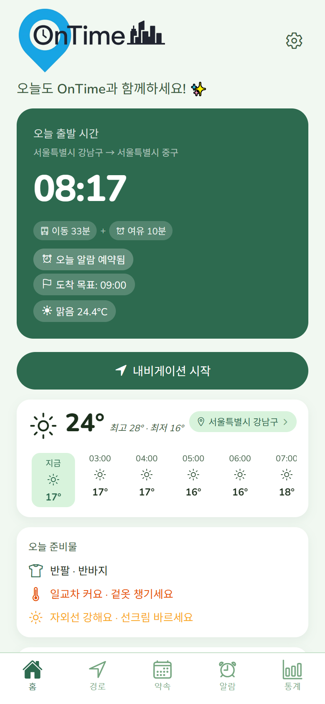

# OnTime

> 실시간 교통·날씨를 분석해 최적 출발 시간을 계산하고 알려주는 스마트 알람 앱

지각 걱정 없이 딱 맞는 시간에 출발할 수 있도록, 카카오맵 실시간 이동 시간과 기상청 날씨 예보, 그리고 나의 과거 패턴을 합산해 출발 시간을 자동 계산합니다.

---

## 화면 미리보기

| 로그인 | 홈 | 알람 설정 | 통계 |
|---|---|---|---|
|  |  |  |  |

---

## 핵심 알고리즘

```
출발 시간 = 도착 목표 시간
           - 이동 시간        (카카오맵 실시간 API)
           - 여유 시간        (사용자 직접 설정, 0~60분)
           - 날씨 버퍼        (비 +10분 / 눈 +15분, 기상청 API)
           - 개인화 버퍼      (30일 피드백 기반 자동 조정)
```

매분 AlarmScheduler가 실행되어 계산된 출발 시간에 정확히 FCM 푸시 알림을 발송합니다. 오프라인 상황에 대비해 로컬 알람도 함께 등록합니다.

---

## 주요 기능

| 화면 | 기능 |
|---|---|
| **홈** | 오늘 권장 출발 시간 카운트다운, 날씨 현황, 경로 미리보기, 일정 요약 |
| **알람** | 기상 시간 설정, 요일 반복, 여유 시간 슬라이더, 오늘만 건너뛰기 |
| **경로** | 집-목적지 경로 저장, 교통수단 선택, 이동 시간 실시간 조회 |
| **약속** | 약속 시간·장소 등록 → 출발 시간 자동 계산 |
| **통계** | 월별 정시 도착률 차트, 개인화 버퍼 적용 현황, 피드백 기록 |

---

## 기술 스택

### Frontend
| 기술 | 버전 | 용도 |
|---|---|---|
| React Native (Expo) | SDK 54 | 크로스플랫폼 모바일 앱 |
| TypeScript | - | 타입 안정성 |
| React Navigation | v7 | 탭/스택 네비게이션 |
| Zustand | - | 전역 상태 관리 |
| Axios | - | HTTP 통신 + 토큰 갱신 인터셉터 |

### Backend
| 기술 | 버전 | 용도 |
|---|---|---|
| Spring Boot | 3.3.5 | REST API 서버 |
| Java | 17 | 런타임 |
| PostgreSQL | 16 | 메인 데이터베이스 |
| Redis | 7 | API 응답 캐싱 (카카오 1일 / 날씨 1시간) |
| Spring Security + JWT | - | 인증/인가 |

### 외부 API
| API | 용도 |
|---|---|
| **카카오맵** | 주소 검색, 실시간 이동 시간 계산 |
| **기상청 (KMA)** | 시간별 날씨 예보 → 날씨 버퍼 계산 |
| **Firebase FCM** | 서버 발송 푸시 알림 (정확한 시간 보장) |

---

## 아키텍처 포인트

### 알람 이중 보장
서버 AlarmScheduler(매분 실행)가 FCM으로 정확한 시간에 알림을 보내고, 앱 로컬 알람이 인터넷 단절 상황을 백업합니다. 두 경로 모두 같은 출발 시간을 계산하므로 어느 쪽이 울려도 일관성이 유지됩니다.

### 개인화 버퍼
30일간의 "제시간에 도착했나?" 피드백을 분석해, 습관적으로 늦는 사용자에게는 자동으로 더 이른 출발 시간을 안내합니다. 고정값이 아니라 사용할수록 나에게 맞춰지는 구조입니다.

### Redis 캐싱으로 API 비용 절감
같은 경로의 이동 시간은 하루에 한 번만 카카오맵 API를 호출하고, 이후 요청은 Redis에서 반환합니다. 날씨 정보는 1시간 단위로 갱신합니다.

### JWT 자동 갱신
401 응답 발생 시 Axios 인터셉터가 refresh 토큰으로 자동 갱신 후 원래 요청을 재시도합니다. 동시에 여러 요청이 만료되어도 갱신은 한 번만 실행됩니다.

---

## 주요 API

| 메서드 | 엔드포인트 | 설명 |
|---|---|---|
| `POST` | `/api/auth/signup` | 회원가입 |
| `POST` | `/api/auth/login` | 로그인 (JWT 발급) |
| `GET` | `/api/today` | 오늘 권장 출발 시간 |
| `GET` | `/api/routes` | 저장된 경로 목록 |
| `POST` | `/api/routes` | 경로 등록 |
| `GET` | `/api/appointments` | 약속 목록 |
| `POST` | `/api/appointments` | 약속 등록 |
| `GET` | `/api/logs` | 출퇴근 로그 및 피드백 |

---

## 테스트

```bash
cd backend
./gradlew test
# 단위 테스트 16개 + 통합 테스트 21개 = 총 37개
```
